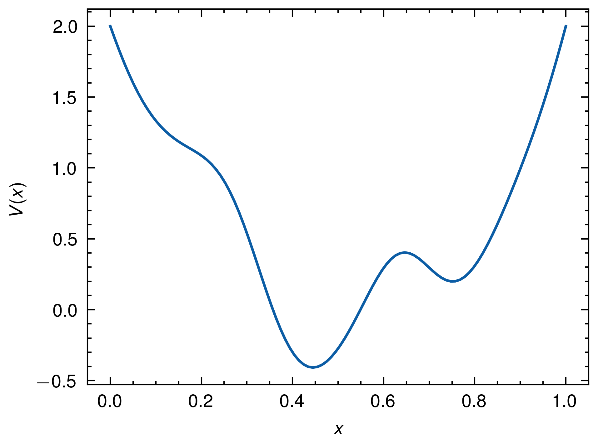
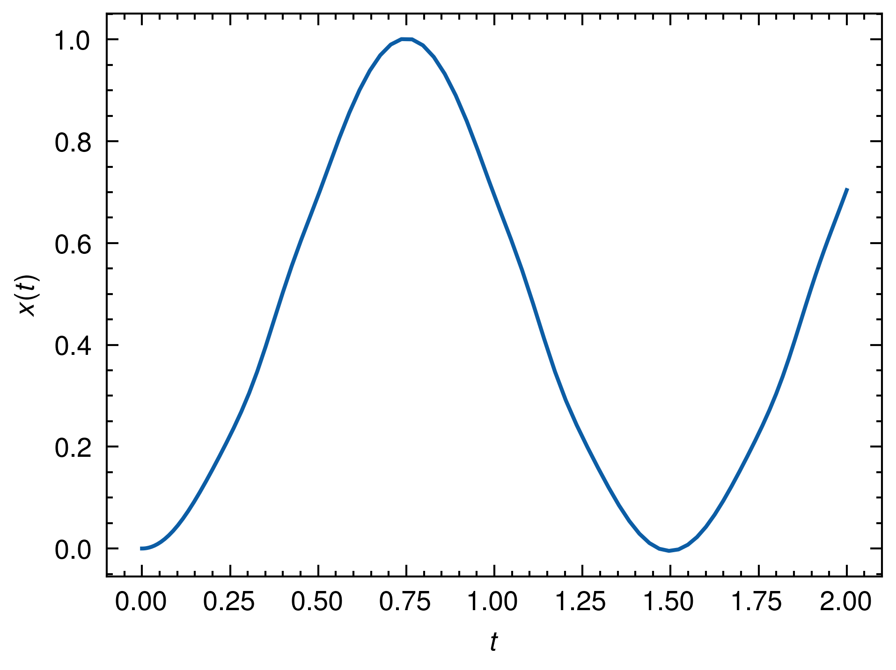
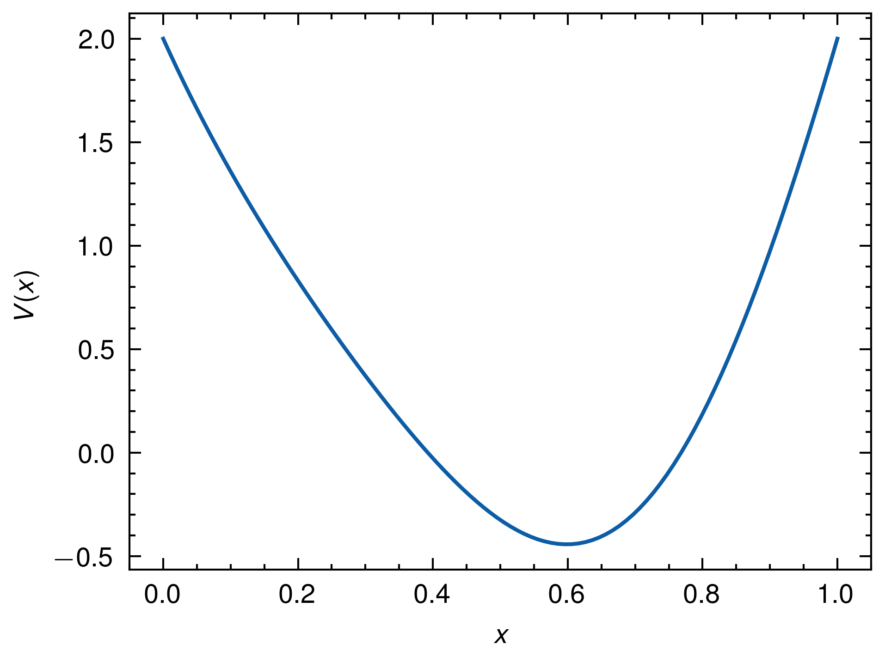
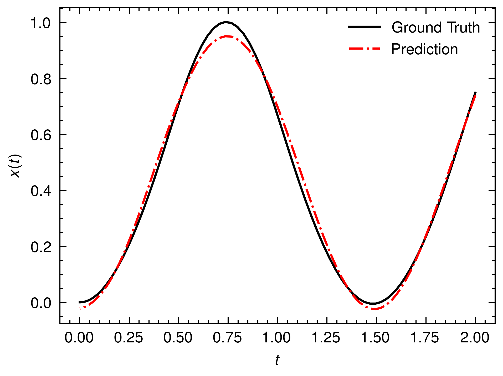
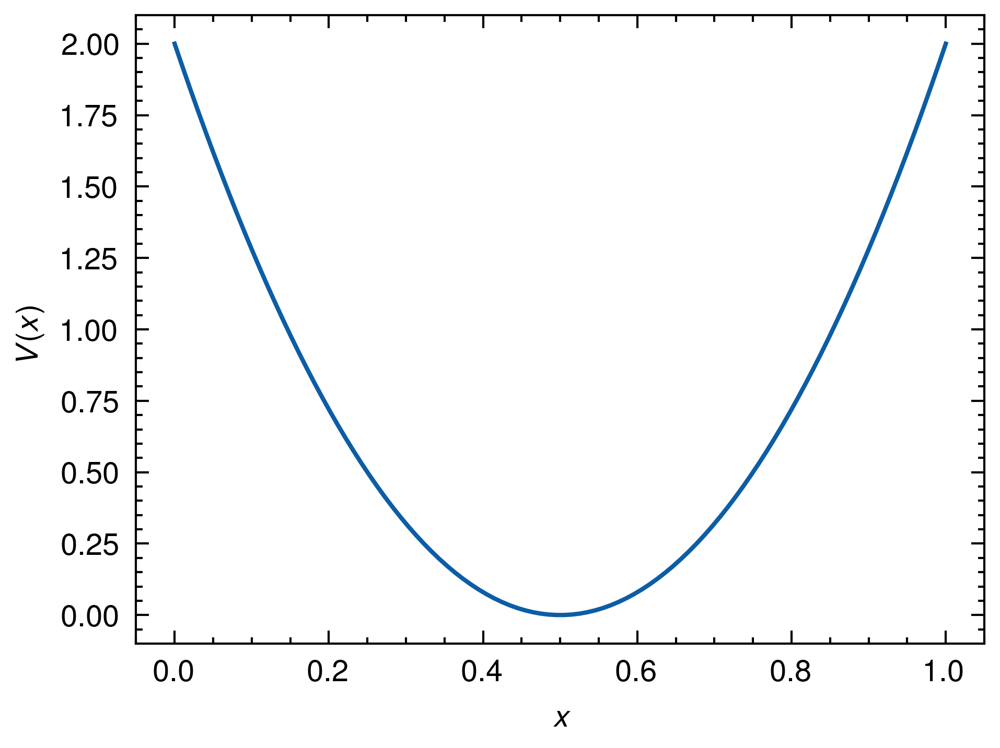
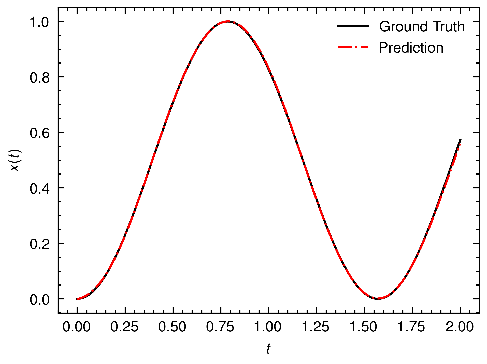

# Neural Hamilton

Use DeepONet to solve Hamilton equations.

## Tech stack

- `rugfield`: Rust library for generating Gaussian Random Fields

- `peroxide`: Rust library for solving ODE & save results as parquet file

- `polars`: Python library for reading parquet file

- `pytorch`: Python library for training DeepONet

- `wandb`: Python library for logging training process

## Problem description

- Input : Potential energy & Target points
  ```math
  V(x) = 2 - 16 \times \text{GRF}(x) \times x(x-1)^2, \quad t = [0,\,0.01,\,\cdots,\,1]
  ```
  

- Hamilton equation:
  ```math
  \begin{aligned}
  \dot{x}(t) &= p(t)\\
  \dot{p}(t) &= -\frac{\partial V}{\partial x}(x(t)) \\
  x(0) &= 0, \quad p(0) = 0
  \end{aligned}
  ```

- Output: Trajectory at target points
  

## Results

- For one of validation data
  

  

- Custom test data
  ```math
  \begin{aligned}
  &V(x) = 8 (x - 0.5)^2,~ x(0) = 0,~ x'(0) = 0 \\
  &x'' = -V'(x) = -16 (x - 0.5) \\
  \Rightarrow ~ &x(t) = 0.5 - 0.5 \cos(4t)
  \end{aligned}
  ```

  

  
